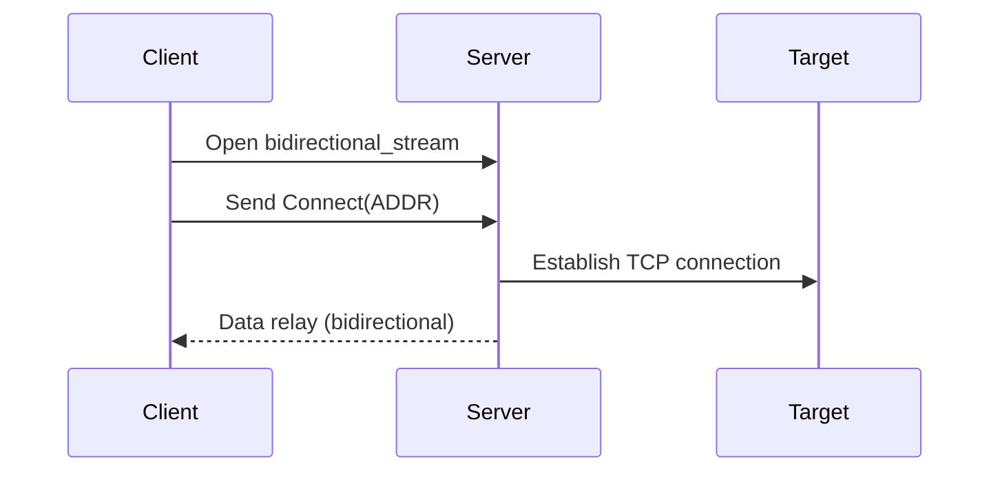

# TUIC Protocol

## Version

`0x05` (Current Protocol Version)

## 1. Overview

The TUIC protocol is a multiplexed TLS-encrypted streaming protocol designed for efficient network relaying. Key characteristics:

- Command-driven negotiation model via `Header` in `Command` structures
- Transport-agnostic design with primary optimization for [QUIC](https://en.wikipedia.org/wiki/QUIC)
- Big Endian byte order for all fields (unless explicitly noted)

## 2. Command Structure

### 2.1 Base Format
```plain
+-----+------+----------+
| VER | TYPE |   OPT    |
+-----+------+----------+
| 1B  | 1B   | Variable |
+-----+------+----------+
```

| Field | Size | Description                 |
| ----- | ---- | --------------------------- |
| VER   | 1B   | Protocol version identifier |
| TYPE  | 1B   | Command type identifier     |
| OPT   | Var  | Type-specific payload       |

### 2.2 Command Types

| Type Code | Command Name   | Description             |
| --------- | -------------- | ----------------------- |
| `0x00`    | `Authenticate` | Stream authentication   |
| `0x01`    | `Connect`      | TCP relay initiation    |
| `0x02`    | `Packet`       | UDP packet relay        |
| `0x03`    | `Dissociate`   | UDP session termination |
| `0x04`    | `Heartbeat`    | Connection keep-alive   |

## 3. Command Specifications

### 3.1 Authenticate Command

```plain
+------+-------+
| UUID | TOKEN |
+------+-------+
| 16B  | 32B   |
+------+-------+
```

| Field | Description                                                  |
| ----- | ------------------------------------------------------------ |
| UUID  | Client identifier (16-byte UUID)                             |
| TOKEN | Authentication token generated via [TLS Keying Material Exporter (RFC 5705)](https://www.rfc-editor.org/rfc/rfc5705) <br />Derivation parameters: <br />  - Label: Client UUID <br />  - Context: Raw password |

### 3.2 Connect Command

```plain
+----------+
|   ADDR   |
+----------+
| Variable |
+----------+
```

| Field | Description                                                |
| ----- | ---------------------------------------------------------- |
| ADDR  | Target address (See [Address Encoding](#5-address-encoding)) |

### 3.3 Packet Command

```plain
+----------+--------+------------+---------+------+----------+
| ASSOC_ID | PKT_ID | FRAG_TOTAL | FRAG_ID | SIZE |   ADDR   |
+----------+--------+------------+---------+------+----------+
| 2B       | 2B     | 1B         | 1B      | 2B   | Variable |
+----------+--------+------------+---------+------+----------+
```

| Field      | Description                                                  |
| ---------- | ------------------------------------------------------------ |
| ASSOC_ID   | UDP session identifier (See [UDP relaying](#43-udp-relaying))   |
| PKT_ID     | Packet sequence identifier (See [UDP relaying](#43-udp-relaying)) |
| FRAG_TOTAL | Total fragments in packet                                    |
| FRAG_ID    | Fragment sequence number                                     |
| SIZE       | Payload length                                               |
| ADDR       | Target address (See [Address Encoding](#5-address-encoding))                        |

### 3.4 Dissociate Command

```plain
+----------+
| ASSOC_ID |
+----------+
| 2B       |
+----------+
```

| Field    | Description                                               |
| -------- | --------------------------------------------------------- |
| ASSOC_ID | UDP session identifier to terminate (See [UDP relaying](#43-udp-relaying) |

### 3.5 Heartbeat Command

```plain
+--+
|  |
+--+
|  |
+--+
```

Empty payload structure for connection liveness verification

## 4. Protocol Workflow

This section describes the protocol flow in detail with QUIC as the underlying transport.

The TUIC protocol doesn't care about how the underlying transport is managed. It can even be integrated into other existing services, such as HTTP/3.

### 4.1 Authentication Sequence

1. Client initiates `unidirectional_stream`

2. Sends `Authenticate` command with credentials

3. Server validates token:

   - Valid: Enables relaying operations
   - Invalid: Terminates connection

4. Subsequent commands processed post-authentication

> If the server receives other commands before the `Authenticate` command, it could accept the command header part and pause. After the connection is authenticated, the server should resume all the paused tasks.

### 4.2 TCP Relaying



### 4.3 UDP Relaying

TUIC achieves 0-RTT Full Cone UDP forwarding by syncing UDP session ID (associate ID) between the client and the server. Both the client and the server should create a UDP session table for each QUIC connection, mapping every associate ID to an associated UDP socket.

#### Session Establishment

1. Client initiates `unidirectional_stream/datagram`
2. Client generates 16-bit ASSOC_ID
3. First `Packet` command creates server-side UDP socket
4. Bidirectional packet forwarding:
   - Client→Server: Target address in ADDR
   - Server→Client: Source address in ADDR

#### Fragmentation Handling

A UDP packet can be fragmented into multiple `Packet` commands. Field `PKT_ID`, `FRAG_TOTAL` and `FRAG_ID` are used to identify and reassemble the fragmented UDP packets.

#### Session Termination

- Client sends `Dissociate` command
- Server releases UDP socket and session state

### 4.4 Heartbeat Mechanism

- Periodic `Heartbeat` via QUIC datagrams
- Maintains connection during active relaying
- Frequency: Implementation-defined (recommended 30-60s interval)

## 5. Address Encoding

```
+------+----------+----------+
| TYPE |   ADDR   |   PORT   |
+------+----------+----------+
| 1B   | Variable | 2B       |
+------+----------+----------+
```

| Type | Value  | Format                             |
| ---- | ------ | ---------------------------------- |
| None | `0xFF` | No address/port.                   |
| FQDN | `0x00` | Length-prefixed domain (1B length) |
| IPv4 | `0x01` | 4-byte address                     |
| IPv6 | `0x02` | 16-byte address                    |

Address type `None` is used in `Packet` commands that is not the first fragment of a UDP packet.

## 6. Error Handling

The protocol employs fail-silent error management:

- Invalid commands: Connection termination or silent discard
- Network errors: Stream closure without notification
- Implementation guidelines:
  - Log errors for diagnostics
  - Prefer connection reset for critical failures
  - Graceful degradation for recoverable errors

